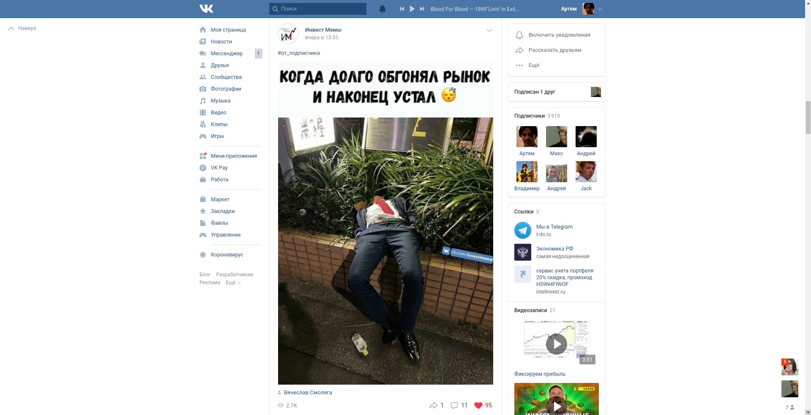

# UsableVK
Делает новый дизайн вконтакте менее бесполезным. Конкретный список изменений относительно актуальной версии
веб-приложения спустя годы составить не особо возможно. Но фон белый, кнопка лайков справа, изображения в ленте и 
группах занимают всю доступную ширину, все квадратное, общий визуальный шум уменьшен, используемая площадь - увеличена.

Все делается исключительно для себя, поэтому претензии и критика не принимаются :)

Использовать вместе с плагинами по типу [этого](https://chrome.google.com/webstore/detail/user-javascript-and-css/nbhcbdghjpllgmfilhnhkllmkecfmpld?hl=en).

